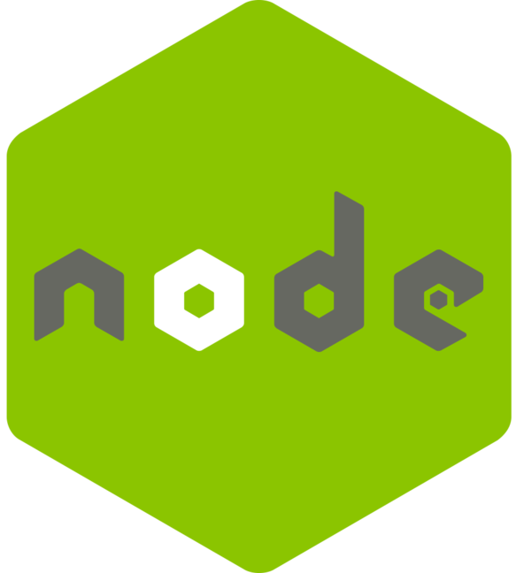

## :man_technologist: INTRODUCTION :man_technologist:
Greetings! I'm Michael and I am recent Computer Science graduate (September 2021) & Junior Software Engineer!

I was exposed to programming early in high school, but my fear of undertaking academically challenging courses discouraged me from pursuing it as an interest or career. It took getting to graduate school in a completely unrelated discipline and on a different career path to rediscover computer programming. With the confidence I had developed over the years, I fell in love with the discipline of computer science. I like having the constant opportunity to learn and grow, and strive to get a little better each day while helping others on their own journey.

---

## CONNECT WITH ME

---

## :toolbox: TECHNOLOGIES & TOOLS :toolbox:
                      
 

---

### GITHUB STATS

<!--
**M-Croghan/m-croghan** is a ✨ _special_ ✨ repository because its `README.md` (this file) appears on your GitHub profile.

Here are some ideas to get you started:

- 🔭 I’m currently working on ...
- 🌱 I’m currently learning ...
- 👯 I’m looking to collaborate on ...
- 🤔 I’m looking for help with ...
- 💬 Ask me about ...
- 📫 How to reach me: ...
- 😄 Pronouns: ...
- ⚡ Fun fact: ...
-->
